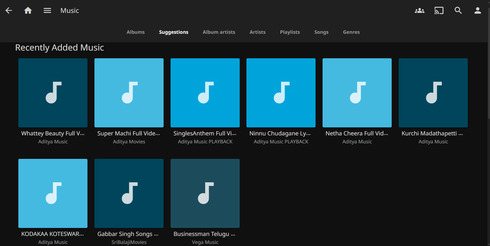

# AI Music Server

**Personal AI-powered music server combining Jellyfin management with Librosa-based embeddings and similarity search using FAISS.**

## Overview
A personal music server that lets you manage, stream, and analyze your music collection. Music is uploaded and managed via **Jellyfin**, giving local access and potential global streaming via VPN. Audio features are extracted using **Librosa** and stored in a **FAISS index file** inside the `embeddings/` folder for fast similarity search. This lays the groundwork for future features like song recommendations, autoplay, and smart playlists.

## Tech Stack
- **Python** – server scripts and audio embeddings  
- **FastAPI** – web server for optional API endpoints  
- **Uvicorn** – ASGI server for running the FastAPI app  
- **Jellyfin** – music management and streaming  
- **Librosa** – audio feature extraction for embeddings  
- **FAISS** – vector index for fast similar song search  

## Features
- Upload and manage music via Jellyfin.  
- Generate song embeddings using Librosa and store them as a FAISS `.index` file.  
- Quickly find similar songs using the FAISS index.  
- Run a local server for additional features and integrations.  
- Future scope: global streaming, autoplay, and next-song recommendation logic.  

## Folder Structure
```bash
ai_music/
├── server/           
│   ├── main.py       # FastAPI app and endpoints
│   ├── embeddings.py # Scripts to generate embeddings using Librosa
│   └── faiss.py      # Scripts to create and query the FAISS index
├── music/            # Your uploaded music files (linked in Jellyfin)
├── embeddings/       # Librosa-generated embeddings and FAISS index (.index file)
├── __pycache__/      # Python cache (ignored)
└── README.md         # Project documentation
```


## Setup Instructions

1. **Clone the repository**:  
```bash
git clone https://github.com/PrabhatRe/ai_music.git
cd ai_music
```
2. **Set up Jellyfin and point it to the `music/` folder for streaming.**
3. **Generate embeddings for your music**
```python
python server/embedding.py
```
- Scans the `music/` folder.

- Uses Librosa to extract audio features for each song.

- Saves the embeddings as `embeddings.npy` inside the `embeddings/` folder.

4. **Build the FAISS index**
```python
python server/faiss.py
```

- Reads embeddings.npy.

- Creates a FAISS index for fast similarity search.

- Saves it as faiss.index in the embeddings/ folder

5. **Run the FastAPI server**
```python
uvicorn server/main:app --host 0.0.0.0 --port 8000 --reload
```
- Server will be accessible at `http://127.0.0.1:8000`.

- Root endpoint shows server status:
```ngnix
GET http://127.0.0.1:8000/
```
6. **Use the `/recommend` endpoint**
- Fetch similar songs by querying:
```php-template
GET http://127.0.0.1:8000/recommend?song=<song_name>&top_n=<N>
```
- Example
```ngnix
GET http://127.0.0.1:8000/recommend?song=song_1.mp3&top_n=5
```
- Returns JSON with top similar songs and automatically starts playback of the first recommendation via Jellyfin.
```json
{
  "query": "song_1.mp3",
  "recommendations": ["song_2.mp3", "song_3.mp3", "song_4.mp3"]
}

```

7. **Run the server (FastAPI + Uvicorn example):**
```bash
uvicorn main:app --host 0.0.0.0 --port 8000 --reload
```


## Screenshots

### Jellyfin Music Library

